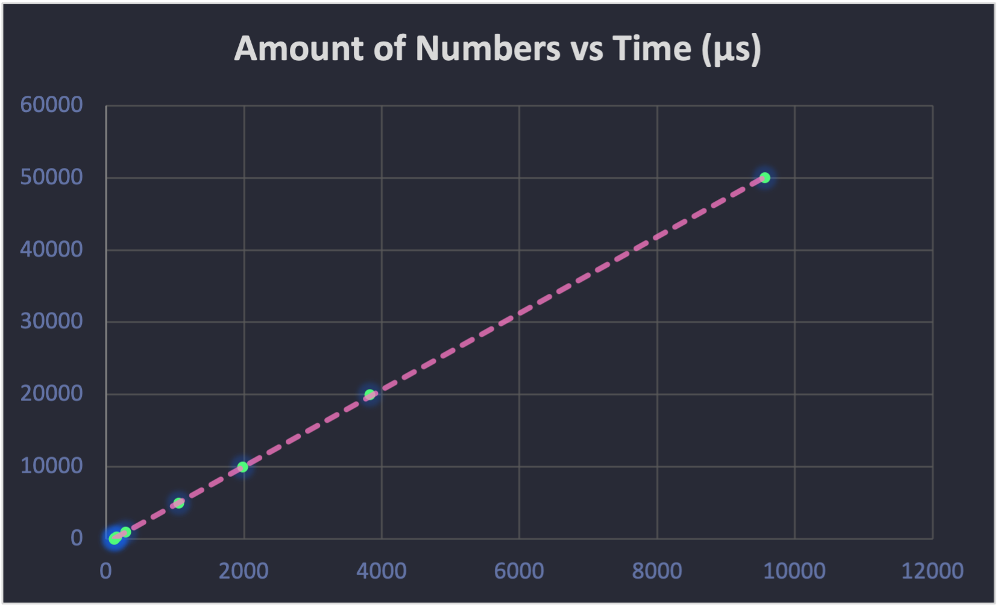

## Algorithm and Implementation

There are three main files in this project:

- `generate_numbers.cpp`: Generates random numbers between 1 and 100.
- `main.cpp`: Receives a file of numbers separated by a newline, calculates the sum of the numbers, prints the result and the amount of time it took to perform the sum.
- `run_test_cases.sh`: Compiles and runs the program for each test case and saves the amount of time it took to perform the sum in a file.

The algorithm that's used to compute the sum of the numbers is the following:

```cpp
int sum = 0;
while (!file.eof())
{
    int n;
    file >> n;
    sum += n;
}
```

## Results

| Amount of Numbers $(n)$ | Time taken to sum $(\mu s)$ |
| ----------------------- | --------------------------- |
| 10                      | $117 \mu s$                 |
| 50                      | $120 \mu s$                 |
| 100                     | $119 \mu s$                 |
| 150                     | $125 \mu s$                 |
| 300                     | $151 \mu s$                 |
| 1000                    | $277 \mu s$                 |
| 5000                    | $1050 \mu s$                |
| 10000                   | $1978 \mu s$                |
| 20000                   | $3828 \mu s$                |
| 50000                   | $9566 \mu s$                |



$$
t=5.291x-508.81
$$

$$
R^2 = 1
$$

As you can see, the graph is linear, and the $R^2$ value is 1. This means that the graph is a good fit for the data. Taking this into account, we can say that the algorithm used to compute the sum of the numbers is linear. The big O notation of the algorithm is $O(n)$ because the amount of time it takes to compute the sum of the numbers is directly proportional to the amount of numbers.

## Hardware

For this activity I used a MacBook Pro (13-inch, 2018, Four Thunderbolt 3 Ports) with the following specs:

- **Processor:** 2.3 GHz Quad-Core Intel Core i5
- **Memory:** 8 GB 2133 MHz LPDDR3
- **Graphics:** Intel Iris Plus Graphics 655 1536 MB
