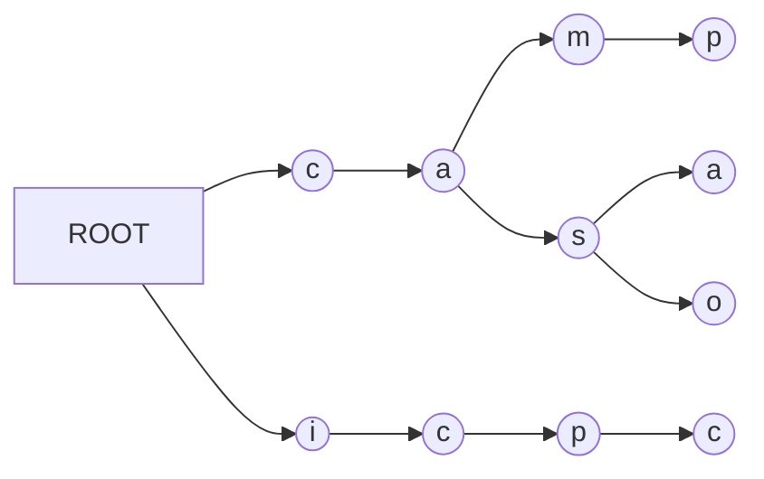
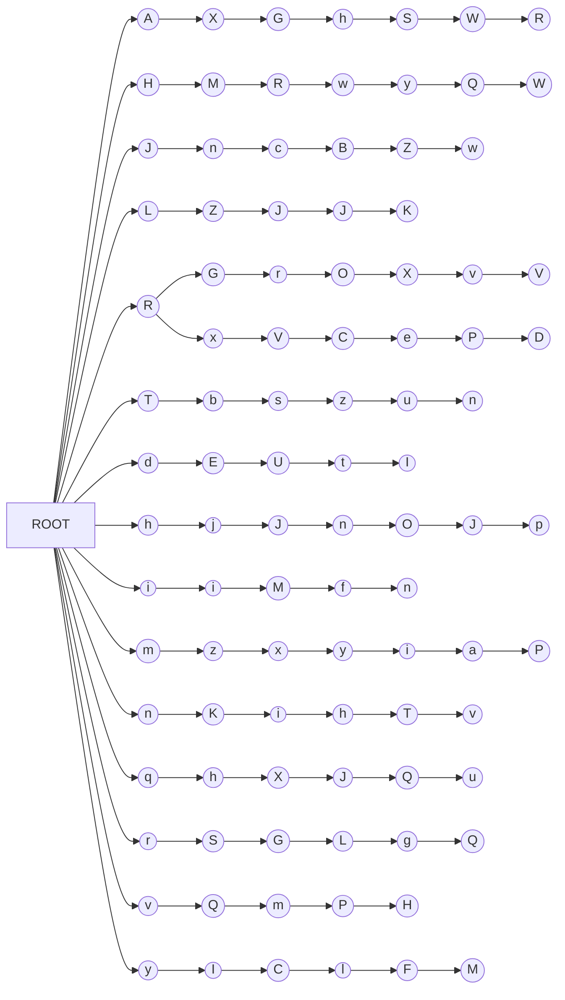
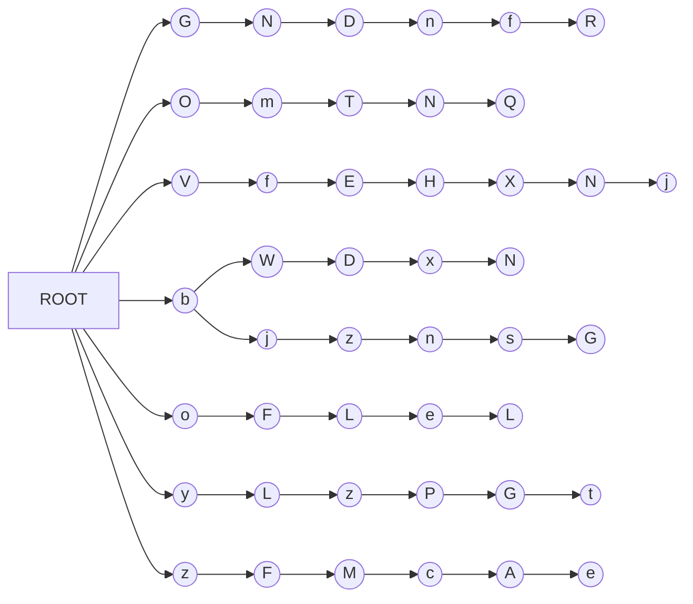
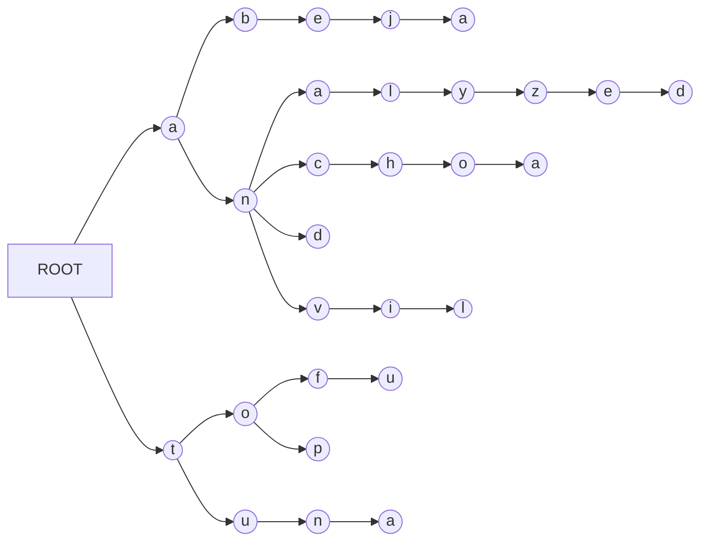

## Problem Description

- Write a C++ program that implements a TRIE data structure.
- Write also a program that allows to verify its functionality.

The input to the program is a number $N$, followed by $N$ words, which will be inserted into the structure. Then read a number $M$ followed by $M$ words to be searched in the structure.

The output of the program is the DFS path of the TRIE, followed by $M$ booleans corresponding to the result of searching each of the $M$ words in the structure.

## Algorithm Implementation

For this activity, we implemented a TRIE data structure, which is a tree data structure that stores strings. Each node in the TRIE has a maximum of 26 children, one for each letter of the alphabet. The root node is the empty string. Each node in the TRIE has a boolean value that indicates whether the path from the root to that node is a word in the TRIE.

Rather than using pointers, to represent the connections between nodes, we used a vector of `Node` objects, where each `Node` object has a map of `<char, int>` pairs, where the key is the character of the edge and the value is the index of the node in the vector. This way, we can represent the connections between nodes without using pointers. This isn't the traditional way of implementing a TRIE, but it is used greatly in competitive programming, where dealing with pointers can be a problem.

These are the functions that we implemented:

```cpp
struct Node
{
    map<char, int> next;

    bool end = false;
};
vector<Node> trie;
int current_node = 0;

int new_node()
{
    trie.push_back(Node());
    return current_node++;
}
```

This function creates a new node and returns its index in the vector.

```cpp
void add(string &word)
{
    int curr = 0;
    for (int i = 0; i < word.size(); i++)
    {

        if (!trie[curr].next.count(word[i]))
        {
            trie[curr].next[word[i]] = new_node();
        }
        curr = trie[curr].next[word[i]];
    }
    trie[curr].end = true;
}
```

This function adds a word to the TRIE. It starts at the root node, and then it iterates through the characters of the word. If the current node doesn't have a child with the current character, it creates a new node and adds it to the current node's children. Then, it moves to the child node with the current character. When it reaches the last character of the word, it sets the `end` boolean of the current node to `true`. Inserting a word into the TRIE takes $O(|word|)$ time.

```cpp
bool search(string &word)
{
    int curr = 0;
    if (output == Output::ascii)
    {
        cout << endl
             << "Searching for " << word << "..." << endl
             << endl;
        cout << "ROOT --> ";
    }

    if (output == Output::mermaid)
    {
        cout << "graph LR" << endl;
        cout << "ROOT --> ";
    }

    for (int i = 0; i < word.size(); i++)
    {
        if (!trie[curr].next.count(word[i]))
        {
            if (output == Output::ascii || output == Output::mermaid)
            {
                cout << "NULL" << endl;
            }

            return false;
        }
        if (output == Output::ascii)
            cout << word[i] << endl;

        if (output == Output::mermaid)
            cout << word[i] << i << "((" << word[i] << "))" << endl;

        curr = trie[curr].next[word[i]];
        if (output == Output::ascii)
            cout << word[i] << " --> ";
        if (output == Output::mermaid)
            cout << word[i] << i << "((" << word[i] << "))"
                 << " --> ";
    }
    if (output == Output::ascii || output == Output::mermaid)
    {

        cout << ((trie[curr].end) ? "END" : "NULL") << endl
             << endl;
    }

    return trie[curr].end;
}
```

This function searches for a word in the TRIE. It starts at the root node, and then it iterates through the characters of the word. If the current node doesn't have a child with the current character, it returns `false`. If it does, it moves to the child node with the current character. When it reaches the last character of the word, it returns the value of the `end` boolean of the current node. Searching for a word in the TRIE takes $O(|word|)$ time.

```cpp
void dfs(int currNodeIndex = 0, string word = "", int level = 0, bool flag = false)
{

    for (auto i : trie[currNodeIndex].next)
    {
        if (output == Output::mermaid)
        {

            if (currNodeIndex == 0)
            {

                cout << "ROOT --> " << i.first << 0 << "((" << i.first << "))" << endl;
                level = level + currNodeIndex + 1;
                flag = true;
                // cout << level << endl;
            }
            else if (flag)
            {
                cout << word[word.size() - 1] << 0 << "((" << word[word.size() - 1] << "))"
                     << " --> "
                     << i.first << (word.size()) * level << "((" << i.first << "))" << endl;
                flag = false;
            }

            else
            {
                cout << word[word.size() - 1] << (word.size() - 1) * level << "((" << word[word.size() - 1] << "))"
                     << " --> "
                     << i.first << (word.size()) * level << "((" << i.first << "))" << endl;
            }
        }

        if (output == Output::minimal)
        {
            cout << i.first << endl;
        }

        if (output == Output::ascii)
        {

            if (currNodeIndex == 0)
            {
                cout << "ROOT --> " << i.first << endl;
            }
            else
            {
                cout << word[word.size() - 1] << " --> " << i.first << endl;
            }
        }

        word.push_back(i.first);

        dfs(i.second, word, level, flag);
        word.pop_back();
    }
}
```

This function traverses the TRIE in a depth-first search manner. It starts at the root node, and then it iterates through the children of the current node. For each child, it calls the function recursively, passing the index of the child node. It prints the character of the edge between the current node and the child node, and then it moves to the child node. Traversing the TRIE takes $O(|trie|)$ time.

```cpp
void printWordsOrdered(int currentNodeIndex = 0, string word = "")
{
    if (trie[currentNodeIndex].end)
    {
        cout << word << endl;
    }
    for (auto i : trie[currentNodeIndex].next)
    {
        word.push_back(i.first);
        printWordsOrdered(i.second, word);
        word.pop_back();
    }
}
```

This function prints all the words in the TRIE in alphabetical order (using DFS traversal). It starts at the root node, and then it iterates through the children of the current node. For each child, it calls the function recursively, passing the index of the child node. It prints the character of the edge between the current node and the child node, and then it moves to the child node. If the current node is the end of a word, it prints the word. Traversing the TRIE takes $O(|trie|)$ time.

## Different Output Formats

The program can output the TRIE in three different formats:

- ASCII
- Minimal
- Mermaid

The ASCII format is the default output format. It prints the TRIE in a tree-like format, with each node on a new line, and each edge represented by a `-->` symbol.

The Minimal format prints the TRIE in a minimal format, with each node on a new line, and each edge represented by a single character. For the queries it only prints the result of the query.

The Mermaid format prints the TRIE in a Mermaid format, which can be used to generate a graph of the TRIE.

In order to change the output format, you can add one of the following arguments to the `main.cpp` file:

- `ascii` for ASCII
- `minimal` for Minimal
- `mermaid` for Mermaid

## Program Generates Test Cases

We also created a separate program that generates test cases for the TRIE (`generate_test_case.cpp`) . It generates a random number of words, and then it generates a random number of queries. It then saves the words and queries in a file, which can be used as input for the TRIE program.

The usage of the program is as follows:

```bash
./generate_test_case <output_file> <num_words_min> <num_words_max> <word_length_min> <word_length_max> <num_querys>
```

## Test Cases

For this project, we will use the following test cases:



`test1.txt`: 4 words inserted in the structure. 4 of the 6 words searched are valid in the structure.



`test2.txt`: 16 words generated randomly inserted in the structure. 1 word searched twice. 3 of the 6 words searched are valid in the structure.



`test3.txt`: 8 words generated randomly inserted in the structure. 1 word searched twice. 3 of the 6 words searched are valid in the structure.



`test4.txt`: 8 words that start with the prefixes "an", "to" and "tu" inserted in the structure. 2 of the 6 words searched are valid in the structure.

**Note:** The `test2.txt` and `test3.txt` we generated using the above-mentioned program. To view the whole results, please check the `results` folder.

## Hardware

For this activity we used a MacBook Pro (13-inch, 2018, Four Thunderbolt 3 Ports) with the following specs:

- **Processor:** 2.3 GHz Quad-Core Intel Core i5
- **Memory:** 8 GB 2133 MHz LPDDR3
- **Graphics:** Intel Iris Plus Graphics 655 1536 MB
