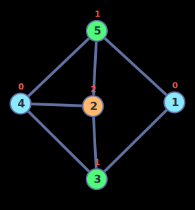
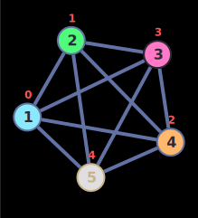
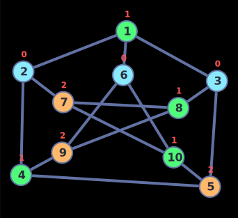
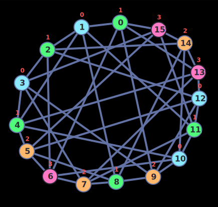

## Problem Description

Write a C++ program that proposes a solution to the graph coloring problem.

The input to the program is an undirected graph, in the form of an adjacency matrix.
If it is not possible to assign different colors to each node, the message "It is not possible to assign colors to nodes" is displayed.
If it is possible to assign different colors to adjacent nodes, the output is a list of colors assigned to each node.

**Sample input:**

```text
5
0 0 1 0 1
0 0 1 1 1
1 1 0 1 0
0 1 1 0 1
1 1 0 1 0
```

**Sample output:**

```text
Node: 0, Assigned Color: 0
Node: 1, Assigned Color: 0
Node: 2, Assigned Color: 1
Node: 3, Assigned Color: 2
...
```

## The Graph Coloring Problem

The graph coloring problem is a problem in graph theory that consists of assigning colors to the vertices of a graph, subject to the following constraints:

- No two adjacent vertices can have the same color.
- No vertex can have more than one color.
- The number of colors used must be the minimum possible.

The graph coloring problem is a NP-complete problem, which means that it is not possible to find an optimal solution in polynomial time. However, it is possible to find a suboptimal solution in polynomial time using a greedy algorithm.

## Algorithm Implementation

Two different solutions are proposed, one using a greedy algorithm and the other using a backtracking algorithm. The greedy algorithm is implemented in the function `greedy_coloring` and the backtracking algorithm is implemented in the function `backtracking_coloring`. You can choose which algorithm to use by adding the parameter `-m` to the command line, for example:

```bash
./main -m greedy # Use greedy algorithm
./main -m backtracking # Use backtracking algorithm
```

When no parameter is added, the greedy algorithm is used by default.

You can also choose the number of colors to use by adding the parameter `-c` to the command line, for example:

```bash
./main -c 3 # Use 3 colors
./main -c 4 # Use 4 colors
```

When no parameter is added, the number of colors is set to 4 by default.

### Greedy Algorithm

```cpp
void greedy_coloring(int n)
{
    vector<int> colors(n + 1, 0);        // Vector of colors
    vector<vector<int>> adj_list(n + 1); // Adjacency list

    // Instead of using an adjacency matrix, we use an adjacency list
    for (int i = 0; i < n; i++)
        for (int j = 0; j < n; j++)
        {
            int x;
            cin >> x;
            if (x == 1)
            {
                adj_list[i].push_back(j);
                adj_list[j].push_back(i);
            }
        }

    vector<bool> visited(n + 1, false); // Vector of visited nodes
    int current_color = 0;              // Current color

    for (int i = 1; i <= n; i++)
    {
        if (!visited[i])
        {
            visited[i] = true;
            queue<int> q;
            q.push(i);

            while (!q.empty())
            {
                int current_node = q.front();
                q.pop();
                for (int neighbor : adj_list[current_node])
                {
                    if (colors[current_node] == colors[neighbor])
                    {
                        colors[neighbor]++;
                    }
                    current_color = max(current_color, max(colors[current_node], colors[neighbor]));

                    if (current_color > colors_max - 1)
                    {
                        cout << "No es posible asignar colores a los nodos" << endl;
                        return;
                    }

                    if (!visited[neighbor])
                    {
                        visited[neighbor] = true;
                        q.push(neighbor);
                    }
                }
            }
        }
    }

    for (int i = 0; i < n; i++)
    {
        cout << "Node: " << i << ", Assigned Color: " << colors[i] << endl;
    }
}
```

As you can see, the greedy algorithm is very simple. We start by creating a vector of colors, a vector of visited nodes and an adjacency list. Then we assign a color to each node, starting with the color 0. If the color of the current node is the same as the color of one of its neighbors, we assign the next color to the neighbor. We repeat this process until we have assigned a color to each node. We do this by using a queue and a BFS. The time complexity of this algorithm is $O(V + E)$, where $V$ is the number of vertices and $E$ is the number of edges.

### Backtracking Algorithm

```cpp
bool backtracking_coloring(vector<vector<bool>> &adjMatrix, vector<int> &colors, int node = 0)
{
    if (node == adjMatrix.size())
    {
        return true;
    }

    for (int color = 0; color < colors_max; color++)
    {
        bool isValid = true;
        for (int i = 0; i < adjMatrix.size() - 1; i++)
        {
            if (adjMatrix[node][i] && colors[i] == color)
            {
                isValid = false;
                break;
            }
        }
        if (isValid)
        {
            colors[node] = color;
            if (backtracking_coloring(adjMatrix, colors, node + 1))
            {
                return true;
            }
            colors[node] = -1;
        }
    }
    return false;
}
```

The backtracking algorithm is a little more complex. It is implemented using recursion. We first declare a vector of colors and an adjacency matrix. Then starting from the first node, we try to assign a color to it. If the color is valid, we assign it to the node, and we call the function again, this time with the next node. If the color is not valid, we try the next color. Once we have tried all the colors and none of them are valid, we return false. If we have assigned a color to each node, we return true. The time complexity of this algorithm is $O\left(m^V\right)$, where $m$ is the number of colors and $V$ is the number of vertices.

## Test Cases

For the following test cases, the number of colors is set to 4 by default. You can find the results of the test cases in the `results` folder.

The colors are assigned as follows:

| Number | Color                                                                                        |
| ------ | -------------------------------------------------------------------------------------------- |
| 0      |  \#8be9fd |
| 1      |  \#50fa7b |
| 2      |  \#ffb86c |
| 3      |  \#ff79c6 |

### Example Test

The test case given in the problem description.



### A Graph with a chromatic number of 5

This graph has a chromatic number of 5, which means that it is not possible to assign 4 colors to the nodes.



### Petersen Graph

The Petersen graph is a graph with 10 nodes and 15 edges. It has a chromatic number of 3.



### Clebsch Graph

The clebsch graph is a graph with 16 vertices and 24 edges. It is a planar graph, which means that it can be drawn in the plane without any edges crossing. It is also a Hamiltonian graph, which means that there is a path that visits each vertex exactly once. The clebsch graph is a graph that can be colored with 4 colors.


